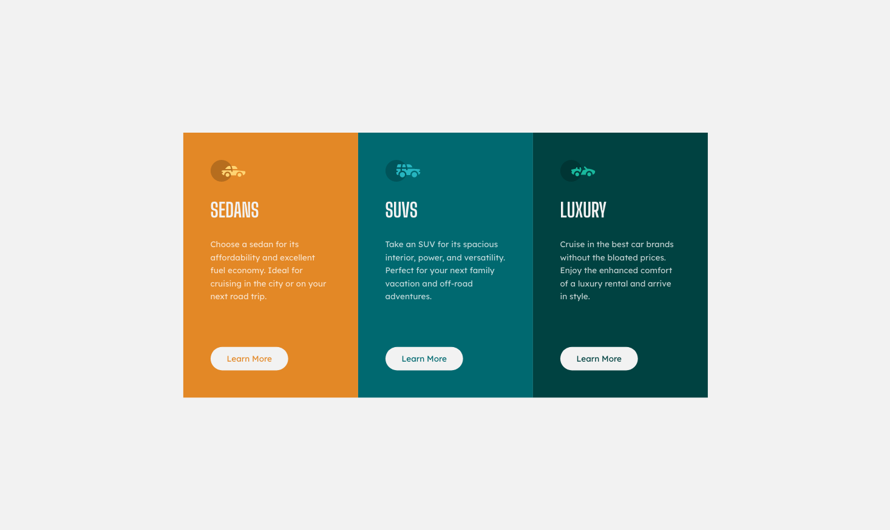

# Frontend Mentor - Three Column Preview Card Component

This is a solution to the [Three Column Preview Card Component](https://www.frontendmentor.io/challenges/3column-preview-card-component-pH92eAR2-/hub/3column-preview-card-component-i3uugyXOUv). Frontend Mentor challenges help you improve your coding skills by building realistic projects.

### The challenge

Users should be able to:

- View the optimal layout depending on their device's screen size
- See hover and focus states for interactive elements

### Screenshot

### Built with

- HTML5
- CSS
